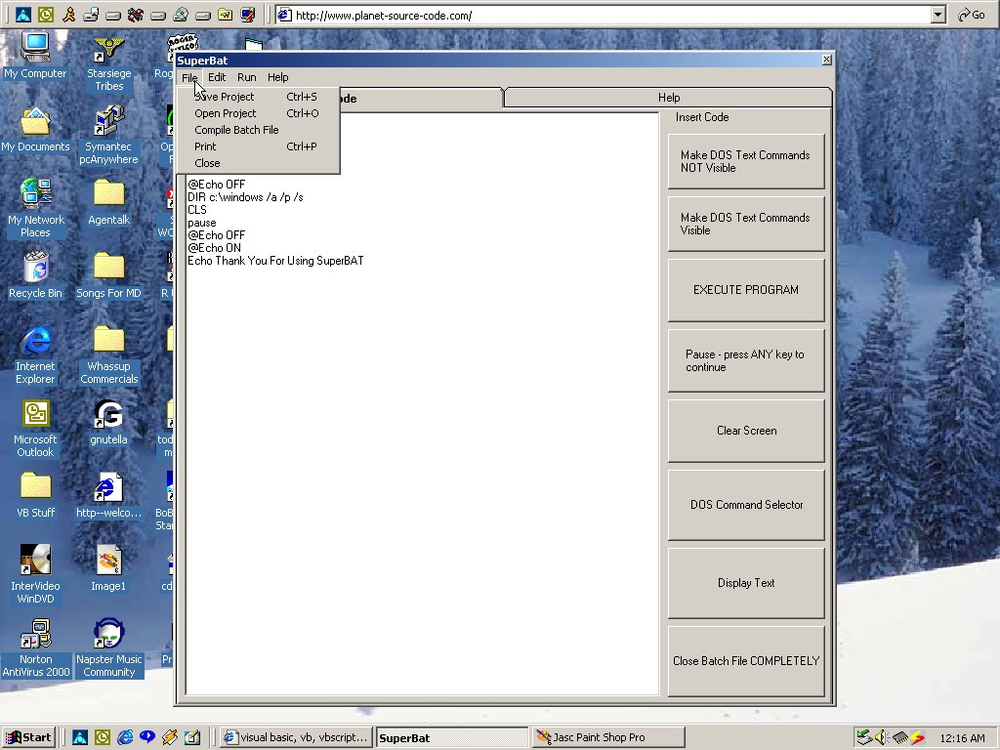

<div align="center">

## SuperBAT \*\*Bug Fix\*\*\*


</div>

### Description

Simple To use BATCH file creator. BATCH files are used for automation, installation, and so called 'macros'.
 
### More Info
 


<span>             |<span>
---                |---
**Submitted On**   |2000-05-14 10:45:30
**By**             |[Sum1Else](https://github.com/Planet-Source-Code/PSCIndex/blob/master/ByAuthor/sum1else.md)
**Level**          |Intermediate
**User Rating**    |4.1 (65 globes from 16 users)
**Compatibility**  |VB 5\.0, VB 6\.0
**Category**       |[Complete Applications](https://github.com/Planet-Source-Code/PSCIndex/blob/master/ByCategory/complete-applications__1-27.md)
**World**          |[Visual Basic](https://github.com/Planet-Source-Code/PSCIndex/blob/master/ByWorld/visual-basic.md)
**Archive File**   |[CODE\_UPLOAD57775142000\.zip](https://github.com/Planet-Source-Code/sum1else-superbat-bug-fix__1-8073/archive/master.zip)

### API Declarations

```
Please Vote For my code and submit comments:-)
Oh, and a safety issue. one of the commands is called DELTREE. if used when not need can delete everything in the specifed directory. If testing your BAT, please don't use DELTREE when testing :-) thanks
```


